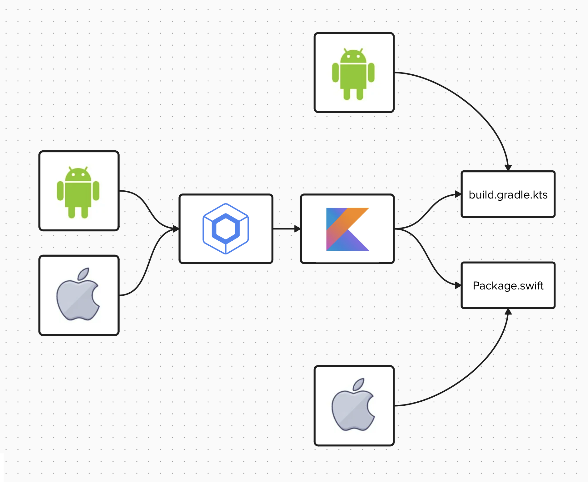

# RadioPlayer

**RadioPlayer**: Demonstrating a multipurpose Kotlin Multiplatform and Swift Package audio player.

RadioPlayer combines shared Kotlin logic with native implementations using ExoPlayer for Android and AVPlayer in Swift for iOS, showcasing the future potential of Kotlin Multiplatform packages.

## Multi-Purpose

This means one repository can serve as both a Kotlin Multiplatform Package and a Native Swift Package, rather than using interpolation and writing native iOS sourceset in Kotlin.

  

## iOS Package

By leveraging the Gradle Plugin for injecting Swift code into the Kotlin Multiplatform Mobile shared module [swift-klib-plugin](https://github.com/a-sit-plus/swift-klib-plugin), RadioPlayer is implemented as a native Swift package.

The iOS component can be developed and maintained independently using the Swift Package Manager, making it easier to manage native iOS code.

It can serve as a native iOS component:

## Android Package

On Android, it utilizes ExoPlayer, a powerful and flexible media player.

